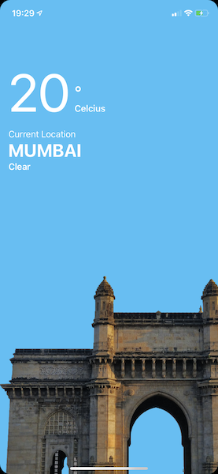
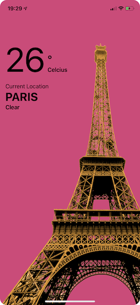

# WeatherApp

SwiftUI Sample for a Weather city application.

Weekend UI challenge proposed by [iam_iosdev](https://www.instagram.com/iam_iosdev/) and designed by [krutik.graphic.h](https://www.instagram.com/krutik.graphic.h/)

## Features used:

- Animations
- GeometryReader

## Screenshots

### Dark mode

### Light mode

